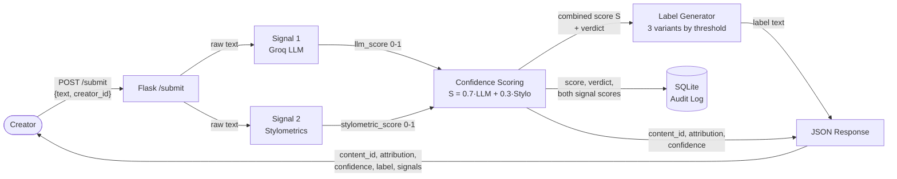
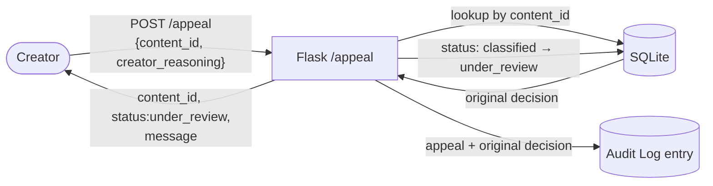

# Provenance Guard — Planning & Specification

This document is written **before any implementation code**. It is both the design spec and the primary prompting tool for the implementation milestones (M3–M5). Every implementation decision should trace back to a section here.

**Guiding principle:** On a creative-writing platform, a *false positive* — flagging a human's own work as AI-generated — is the costly error. It damages trust and insults the creator. Every design decision below is biased to protect against that: a high bar before we say "AI," a wide "uncertain" band, and an appeal path that exists precisely for the cases we get wrong.

---

## 1. Detection Signals

The pipeline uses **two genuinely distinct signals** — one *semantic*, one *structural*. They are independent because they look at different properties of the text, so their combination is more informative than either alone.

### Signal 1 — LLM classification (Groq, `llama-3.3-70b-versatile`)

- **What it measures:** Holistic semantic and stylistic coherence. We send the text to the model with a structured prompt asking it to assess, on a 0–1 scale, how likely the text is AI-generated, and to return that score plus a one-line rationale.
- **Why it differs between human and AI:** LLMs are good at recognizing the "fingerprint" of LLM-generated prose — hedging boilerplate ("It is important to note…"), even rhythm, topic-sentence-then-elaboration structure, and an absence of lived specificity. It reads the text the way a careful human reader would.
- **Output shape:** a float `llm_score ∈ [0, 1]` (1 = reads as AI) plus a short text rationale.
- **Blind spots:** Non-deterministic — the same input can score slightly differently across calls. It can be fooled by lightly human-edited AI text, and it carries the model's own biases (e.g. it may over-flag formal or non-native English as "AI-like"). It is also a black box — we can't fully explain *why* it returned a given score.

### Signal 2 — Stylometric heuristics (pure Python)

Three measurable statistical properties, each computed without external libraries, then normalized to [0, 1] and averaged into one `stylometric_score`.

| Metric | What it captures | Human vs. AI tendency |
| --- | --- | --- |
| **Sentence-length variance** ("burstiness") | How much sentence length varies across the text | Humans are bursty — short punchy sentences next to long winding ones. AI is uniform. |
| **Type-token ratio** (vocabulary diversity) | Unique words ÷ total words | Human writing reuses and repeats idiosyncratically; AI tends toward smooth, moderately-diverse vocabulary. |
| **Punctuation density** | Punctuation marks ÷ words | AI over-uses commas/semicolons in an even, "grammatically correct" rhythm; human casual writing is more erratic. |

- **Normalization (each metric → AI-likeness sub-score in [0,1], 1 = AI-like):**
  - Burstiness = std-dev of per-sentence word counts → `clamp(1 − std/8, 0, 1)` (uniform = AI).
  - TTR = unique ÷ total words → `clamp((0.72 − ttr)/0.27, 0, 1)` (low diversity = AI).
  - Punctuation density = marks ÷ words → `clamp(density/0.15, 0, 1)` (dense, even = AI).
  - *(These bounds are heuristic and tuned against the four M4 calibration inputs.)*
- **Combining the three metrics:** burstiness-weighted, **not** a flat average, because burstiness is the most defensible of the three and TTR/punctuation are noisier:
  `stylometric_score = 0.5·burstiness + 0.25·ttr + 0.25·punctuation`.
- **Output shape:** a float `stylometric_score ∈ [0, 1]` (1 = statistically AI-like — i.e. *uniform*) plus the three raw sub-metrics for transparency in the log.
- **Why it differs between human and AI:** AI text optimizes for fluent averageness, which shows up as low variance and even punctuation. Human text is statistically "lumpier."
- **Blind spots:** Unreliable on **short text** (a 2-sentence submission has almost no variance to measure). It is **content-blind** — it can't tell deliberate stylistic uniformity (a minimalist poem, a legal notice) from AI uniformity, so it will false-positive on intentionally repetitive or simple writing.

### Combining the signals

The two scores combine into a single **AI-likeness score** `S`:

```
S = 0.7 · llm_score + 0.3 · stylometric_score
```

The LLM is weighted heavier (0.7) because it is the stronger, semantically-aware signal; stylometrics (0.3) acts as a structural sanity check and tie-breaker. Both sub-scores are always recorded in the audit log so the combination is fully traceable.

**Short-text exception.** For submissions under ~40 words, stylometrics has too little text to measure reliably (a 1–2 sentence input has almost no variance). In that case the blend shifts to `S = 0.9·llm + 0.1·stylo`, leaning on the LLM rather than trusting noisy structural numbers. *(This rule was added during M4 — see the README spec reflection.)*

---

## 2. Uncertainty Representation

The system **never forces a binary**. The combined score `S ∈ [0, 1]` is mapped to **three verdicts** using two deliberately *asymmetric* thresholds.

| AI-likeness `S` | Verdict (`attribution`) | Reasoning |
| --- | --- | --- |
| `S ≥ 0.70` | `likely_ai` | A **high** bar — we demand strong evidence before flagging a human's work as AI. |
| `0.40 ≤ S < 0.70` | `uncertain` | A **wide** middle band. When the signals don't clearly agree, we say so rather than guess. |
| `S < 0.40` | `likely_human` | A lower bar to land here — humans get the benefit of the doubt. |

**The band is not symmetric around 0.5.** The "uncertain" zone (0.40–0.70) is pulled *upward* toward the AI side, so borderline text drifts toward *uncertain* or *human*, not toward an AI accusation. This is the false-positive asymmetry, encoded in numbers.

**What the displayed confidence means.** We do not show the raw `S` to users — we show how confident we are in *the verdict we actually reached*:

- `likely_ai` → displayed confidence = `S`  (e.g. `S = 0.82` → "82% confident this is AI")
- `likely_human` → displayed confidence = `1 − S`  (e.g. `S = 0.15` → "85% confident this is human")
- `uncertain` → **no percentage is emphasized**; the label states plainly that we couldn't tell.

**So what does 0.5 mean?** `S = 0.5` is *maximally undecided* — it sits in the middle of the uncertain band, and the label admits the system does not know. This is the answer to "decide what 0.5 means to the user first": it means **"we can't tell."**

**How we'll validate the score is meaningful (M4):** run the four deliberately-chosen test inputs (clearly-AI, clearly-human, formal-human, lightly-edited-AI) and confirm they spread across the bands rather than clustering at 0.5 or flipping binary at a single point. If a signal misbehaves, we print `llm_score` and `stylometric_score` separately to isolate the culprit.

---

## 3. Transparency Label Design

The label is what a non-technical reader sees. It must be plain-language (no "classifier," no "logit"), and must visibly change with confidence — not just swap a number.

### Variant A — High-confidence AI (`likely_ai`)

> ⚠️ **Likely AI-generated.** Our analysis found strong signs this text was produced by an AI tool (about **{confidence}%** confidence). Automated detection isn't perfect — **if you wrote this yourself, you can appeal this result.**

### Variant B — High-confidence human (`likely_human`)

> ✓ **Likely human-written.** This text reads as human-authored (about **{confidence}%** confidence). We found no strong signs of AI generation.

### Variant C — Uncertain (`uncertain`)

> ❓ **Inconclusive.** We couldn't determine with confidence whether this text was written by a person or an AI tool. Please treat this result as uncertain — it should not be taken as a judgment either way.

**Design notes:**
- Only the **AI** label invites an appeal. That asymmetry is intentional: the AI verdict is the one that can harm a creator, so it carries the remedy.
- The AI label says "strong signs," never "this is AI" — it owns its own fallibility.
- The uncertain label deliberately omits a percentage, because a number there would imply a precision the system doesn't have.

---

## 4. Appeals Workflow

- **Who can appeal:** any creator who received a classification they dispute (in practice, anyone holding a `content_id`). The flow is built for the `likely_ai` case but accepts any verdict.
- **What they provide:** the `content_id` from their `/submit` response and free-text `creator_reasoning` (e.g. "I wrote this myself; I'm a non-native speaker and my style is formal").
- **What the system does on receipt:**
  1. Looks up the original content record by `content_id`.
  2. Updates that record's `status` from `classified` → `under_review`.
  3. Writes an audit-log entry capturing the appeal *alongside* the original decision (original attribution + confidence + signal scores + the new `creator_reasoning`).
  4. Returns a confirmation `{content_id, status: "under_review", message}`.
- **No automated re-classification** — by design. An appeal flags content for a human and stops there.
- **What a human reviewer would see** when opening the queue: every record with `status = under_review`, showing the original text, the original verdict and both signal scores, the timestamp, and the creator's stated reasoning — enough context to make a human judgment.

---

## 5. Anticipated Edge Cases

These are specific scenarios the system will likely handle *poorly*, named honestly:

1. **Repetitive minimalist poetry.** Short lines, deliberate repetition, and simple vocabulary drive type-token ratio *down* and sentence-length variance *down* — exactly the statistical signature of "uniform = AI." The stylometric signal will push such a poem toward an AI score even though it's a hallmark of intentional human craft. Mitigation: the 0.7 LLM weight and the high (0.70) AI threshold, but it remains a genuine weak spot.

2. **Non-native English speaker writing formally.** Careful, flat, low-burstiness prose with even punctuation looks structurally AI-like, and the LLM itself may carry a bias toward flagging formal/non-native phrasing. This is the canonical false-positive case — and the **direct reason the appeal path exists.**

3. *(Secondary)* **Very short submissions.** A one- or two-sentence input gives stylometrics almost no variance to measure, making that signal essentially noise; the result leans entirely on the LLM. The system should treat such cases as inherently lower-confidence.

---

## Architecture

The system is a Flask app over a SQLite store, with two main flows. **Submission** runs text through both detection signals, combines them into a confidence score, maps that to a transparency label, logs the decision, and returns a structured response. **Appeal** looks up an existing decision by `content_id`, flips its status to `under_review`, logs the appeal next to the original decision, and confirms. A `GET /log` endpoint surfaces the audit log for transparency and grading.

### Submission flow



### Appeal flow



---

## AI Tool Plan

For each implementation milestone, the spec sections below (plus the architecture diagram) are the context handed to the AI coding tool. The pattern is always: **provide spec → ask for a bounded artifact → verify against the spec before wiring in.**

### M3 — Submission endpoint + first signal

- **Spec provided:** §1 Detection Signals (Signal 1 only) + the Submission-flow diagram.
- **Ask the AI to generate:** (1) the Flask app skeleton with the `POST /submit` route stub returning a hardcoded response, and (2) the `llm_signal(text)` function calling Groq and returning `{llm_score, rationale}`.
- **Verify:** Call `llm_signal()` directly on 2–3 inputs and inspect the score before wiring it in. Confirm the route returns the contracted fields (`content_id`, `attribution`, placeholder `confidence`, placeholder `label`). Confirm each `/submit` writes a structured SQLite audit row. Check the function signature matches §1's stated output shape (a 0–1 score, not a binary flag).

### M4 — Second signal + confidence scoring

- **Spec provided:** §1 (Signal 2 + combination rule) + §2 Uncertainty Representation + the diagram.
- **Ask the AI to generate:** (1) the `stylometric_signal(text)` function computing the three metrics and returning a normalized `stylometric_score`, and (2) the `score(llm_score, stylometric_score)` function applying `S = 0.7·LLM + 0.3·Stylo` and the 0.40/0.70 thresholds.
- **Verify:** Confirm the generated thresholds **exactly** match §2 (AI tools often drift to plausible-but-wrong cutpoints) — correct if not. Run the four M4 test inputs and check scores spread across bands. Extend the audit log to record both individual signal scores.

### M5 — Production layer (label, appeal, rate limit, full log)

- **Spec provided:** §3 Label variants + §4 Appeals workflow + the Appeal-flow diagram.
- **Ask the AI to generate:** (1) `generate_label(attribution, confidence)` mapping verdict+confidence to the exact text in §3, and (2) the `POST /appeal` endpoint per §4.
- **Verify:** Ask the AI to print all three label variants and confirm the text matches §3 verbatim. Confirm an appeal updates `status` to `under_review` and logs alongside the original decision before considering it done. Confirm all three labels are reachable via inputs at different confidence levels.
